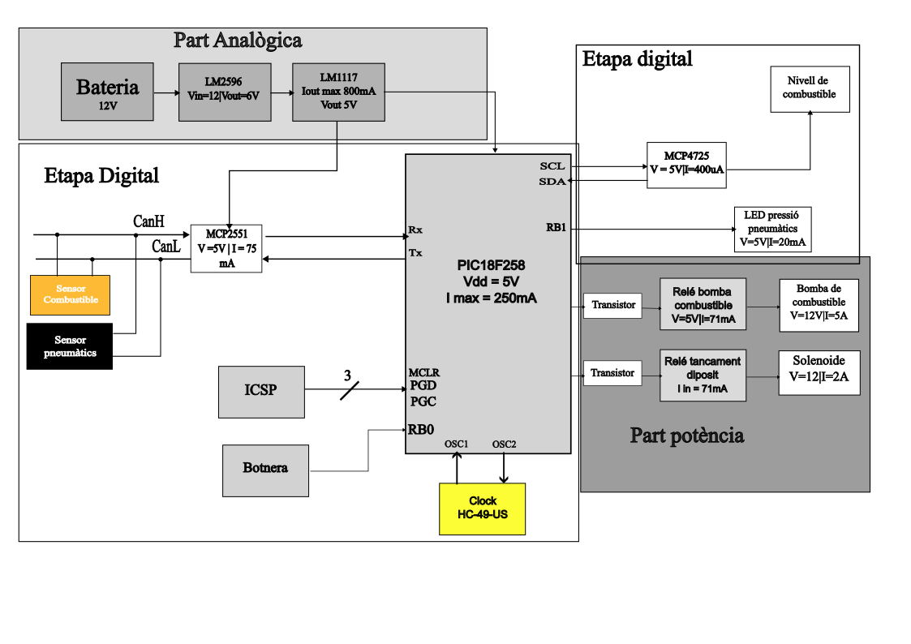

# EL COMBUSTIBLE

## Autors
- Raúl Carod (RaulCarod)
- Sergi Pacheco (sergipacheco55)

## Versió - v1.0 ## Curs - Assignatura de Disseny de PCBs amb KiCad - [Curs 2024-2025]

## Objectiu Descripció breu de l'objectiu del projecte.
L'objectiu del projecte és crear una pcb capaç de controlar el mecanisme de tancament de dipòsit del combustible d'un cotxe, controli el sensor de pressió de pneumàtics i el sensor digital de nivell de combustible i el funcionament de la bomba de combustible.
## Requisits i especificacions
- Llista de requisits tècnics i objectius a assolir.

## Diagrama de blocs (Afegiu una imatge del diagrama de blocs)

## Taula de components
| Descripció                 | Manufacturer Number | Package  | Datasheet | Proveïdor | Unitats |
|----------------------------|--------------------|---------|----------|----------|---------|
| Regulador de tensió        | LM1117            | SOT-223 | [Enllaç](https://www.ti.com/lit/ds/symlink/lm1117.pdf) | DigiKey / Mouser | X |
| Transceptor CAN            | MCP2551           | SOIC-8  | [Enllaç](https://ww1.microchip.com/downloads/en/devicedoc/mcp2551.pdf) | DigiKey / Mouser | X |
| Microcontrolador           | PIC18FXX8         | DIP / QFP | [Enllaç](https://ww1.microchip.com/downloads/en/devicedoc/39564c.pdf) | DigiKey / Mouser | X |
| Cristall de quars          | HC-49-US          | HC-49/US | [Exemple](https://www.txccrystal.com/images/pdf/HC-49US.pdf) | DigiKey / Mouser | X |

## Funcionalitats
- [ ] Funció 1
- [ ] Funció 2
- [ ] Funció 3

## Historial de canvis | Data | Autor | Branch | Descripció |
|------|------|--------|------------| 
| 2025-03-20 | Sergi Pacheco | `main` | Creació del projecte |
| 2025-03-24 | Raúl Carod| `main` | Diagrama de blocs |
